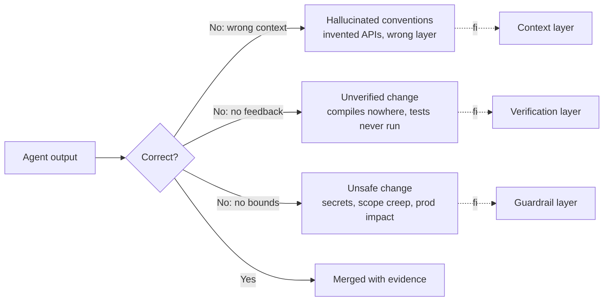
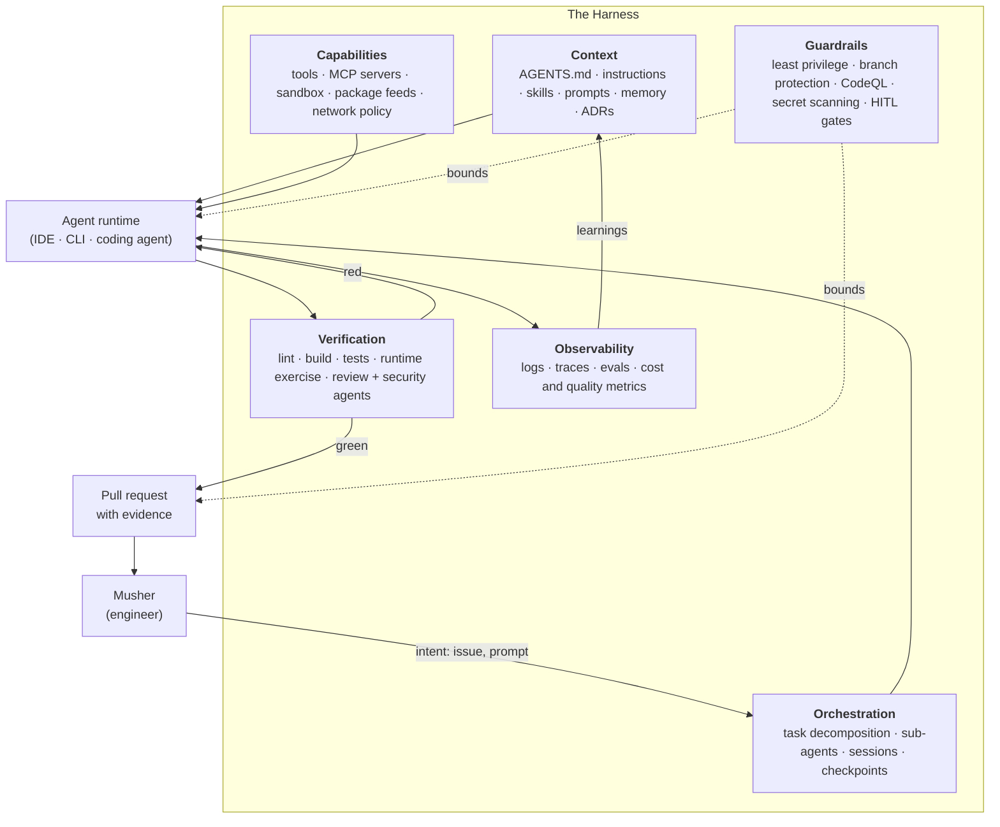
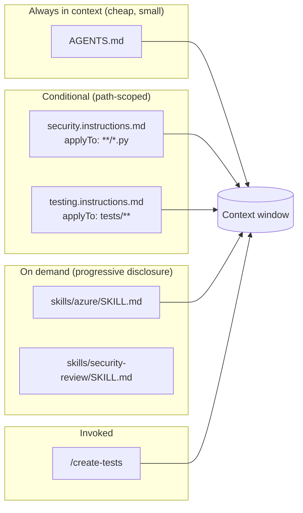
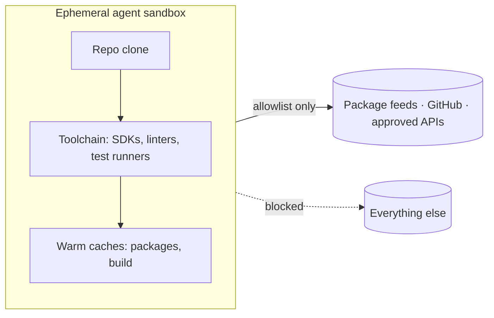
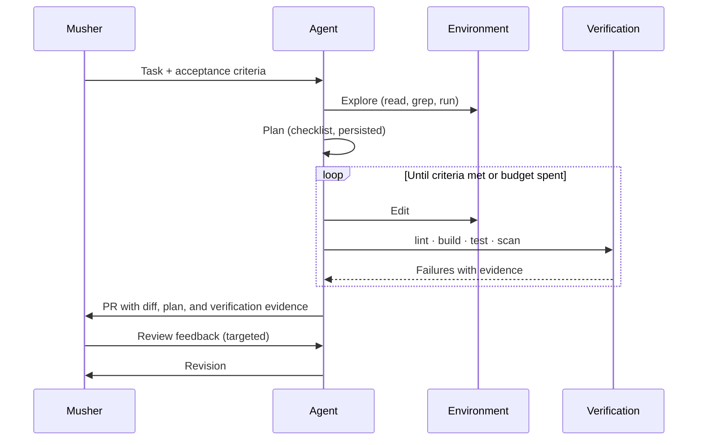
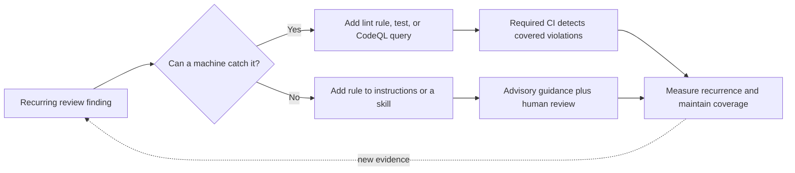
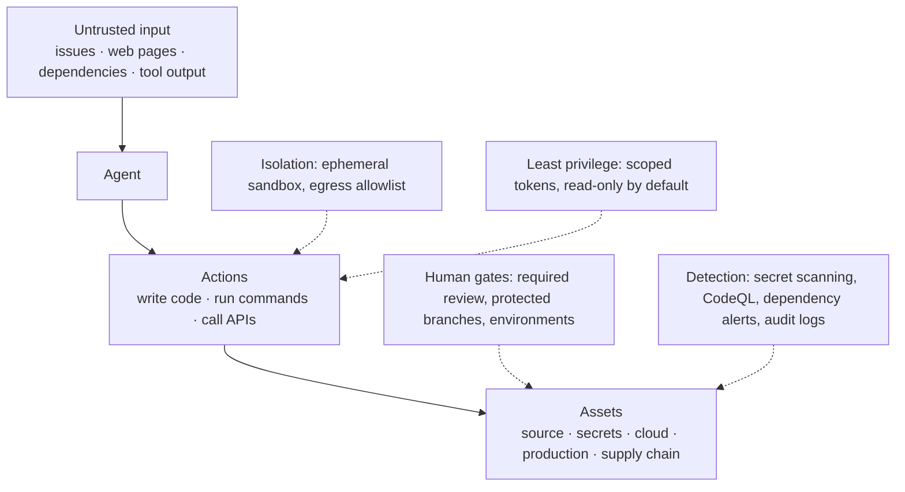
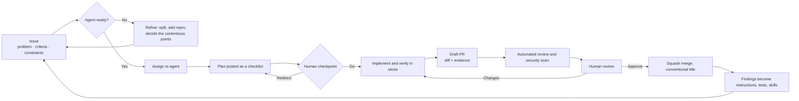

# The Agentic Harness

> **Agents are the sled dogs. You are the musher. The harness is everything in between.**

A reference guide to designing, operating, and hardening the engineering system that surrounds AI coding
agents. Level: **L300 – L400** (practitioner to architect).

Companion deck: [`presentations/agentic-harness-l300.md`](../presentations/agentic-harness-l300.md) — a 60
minute Marp presentation **manually derived** from this document. No generation script is checked in;
shared content changes must be reflected in both the guide and the deck.

Reference implementation of most artefacts named here:
[`frkim/ai-coding-standards`](https://github.com/frkim/ai-coding-standards).

---

## Table of contents

1. [What an agentic harness is](#1-what-an-agentic-harness-is)
2. [The musher mental model](#2-the-musher-mental-model)
3. [Reference architecture](#3-reference-architecture)
4. [Layer 1 — Context engineering](#4-layer-1--context-engineering)
5. [Layer 2 — Capabilities: tools, MCP, and environments](#5-layer-2--capabilities-tools-mcp-and-environments)
6. [Layer 3 — Orchestration patterns](#6-layer-3--orchestration-patterns)
7. [Layer 4 — The verification loop](#7-layer-4--the-verification-loop)
8. [Layer 5 — Guardrails and security](#8-layer-5--guardrails-and-security)
9. [Layer 6 — Observability and evaluation](#9-layer-6--observability-and-evaluation)
10. [The human in the loop](#10-the-human-in-the-loop)
11. [Operating model: issue to merge](#11-operating-model-issue-to-merge)
12. [Maturity model and adoption roadmap](#12-maturity-model-and-adoption-roadmap)
13. [Anti-patterns](#13-anti-patterns)
14. [Reference implementation walkthrough](#14-reference-implementation-walkthrough)
15. [Harness readiness checklist](#15-harness-readiness-checklist)
16. [Glossary](#16-glossary)
17. [References](#17-references)

---

## 1. What an agentic harness is

An **agentic harness** is the repeatable engineering system that turns a general-purpose coding model into a
dependable contributor to *your* codebase. It is everything the model does not bring with it:

- the **context** that tells the agent how this repository works;
- the **capabilities** (tools, runtimes, credentials, network) it is allowed to use;
- the **orchestration** that splits work across turns, sessions, and agents;
- the **verification** that proves the change is correct before a human looks at it;
- the **guardrails** that bound the blast radius when something goes wrong;
- the **observability and evaluation** that make the whole thing measurable and improvable.

### 1.1 Model ≠ outcome

Two teams using the identical model can get different results. The harness is one important variable,
alongside task difficulty, model limitations, and team expertise.

| Dimension | Weak harness | Strong harness |
| --- | --- | --- |
| Context | "Read the repo and figure it out" | `AGENTS.md`, path-scoped instructions, skills, prompts |
| Capabilities | Chat only, copy-paste | Build, test, run, browse, query — in a sandbox |
| Verification | Human reads the diff | Agent runs lint + build + tests + security scan first |
| Guardrails | Broad tokens, no review | Least privilege, branch protection, required checks |
| Feedback | Tribal knowledge in review comments | Failures fed back into instructions and skills |
| Measurement | "It feels faster" | First-pass CI green rate, revert rate, cycle time |

> **L400 framing.** The model is a *policy*; the harness is the *environment* that policy acts in. You cannot
> usually change a hosted model's weights, but you can shape its observations (context), action space (tools),
> feedback signal (tests and checks), and episode boundaries (task scoping). This is an analogy, not a claim
> that running CI trains the model. **Diagnostic heuristic:** investigate context, tooling, and feedback before
> attributing a failure to model quality; reasoning limits and task ambiguity can remain.
>
> [SWE-agent's interface study](https://arxiv.org/abs/2405.15793) provides task-specific evidence that interface
> design affects agent performance. It does not establish that most failures are environmental.

### 1.2 The three failure modes a harness must prevent



Every component described in this document exists to close one of those three gaps.

---

## 2. The musher mental model

Dog sled teams are the closest working analogy to a multi-agent engineering system: many capable runners, one
human deciding the route, and a mechanical harness that converts individual effort into forward motion.

| Mushing | Agentic engineering | Why the mapping holds |
| --- | --- | --- |
| **Musher** | The engineer / tech lead | Chooses the destination, reads the trail, owns the outcome |
| **Sled dogs** | Coding agents and sub-agents | Fast, tireless, literal — they run the line they are given |
| **Lead dog** | Planner / orchestrator agent | Sets the pace, picks the branch at each fork |
| **Swing dogs** | Specialised agents (security, review, docs) | Steer the team into the turns |
| **Wheel dogs** | Heavy-lift implementation agents | Take the load right at the sled: migrations, refactors |
| **Harness and gangline** | `AGENTS.md`, instructions, skills, prompts, tools | Transfers intent into aligned pull; a tangled line stops the team |
| **Trail markers** | Tests, linters, CI checks, types | Objective signals that the team is still on the route |
| **Snow hook / brake** | Human approval gates, required reviews, kill switch | Stops the team before the drop-off |
| **Commands (hike, gee, haw, whoa)** | Prompts, slash commands, issue assignment | Short, unambiguous, rehearsed instructions |
| **The sled and its load** | The repository and its production commitments | What must arrive intact |
| **Dog booties and vet checks** | Sandboxes, least-privilege tokens, secret scanning | Preventive care beats recovery |
| **Trail food / fuel** | Token and cost budget | Finite; spend it where it moves the sled |
| **Whiteout** | Missing or stale context | The team keeps running, in the wrong direction |

Three rules from the trail that transfer exactly:

1. **You cannot push a sled with dogs.** Pulling works only if every line is attached to the same point — one
   task, one definition of done. Parallel agents with conflicting goals tangle the gangline.
2. **The lead dog is trained, not commanded continuously.** Invest in durable context (the training) instead of
   re-explaining the route in every prompt.
3. **The musher runs too.** On the hills, the musher pedals or runs alongside. Full automation is not the goal;
   sustained pace at low risk is.

---

## 3. Reference architecture



The arrow that matters most is the last one: **failures must become context**. A harness that does not feed
review findings back into instructions and skills re-litigates the same mistake forever.

### 3.1 Where the harness physically lives

```text
repo/
├── AGENTS.md                          # the agent contract (root, read first)
├── .github/
│   ├── copilot-instructions.md        # repository-wide Copilot instructions
│   ├── instructions/*.instructions.md # path-scoped rules (applyTo front matter)
│   ├── prompts/*.prompt.md            # reusable, parameterised tasks
│   ├── skills/<skill>/SKILL.md        # on-demand capability packs
│   ├── workflows/                     # CI: lint, build, test, CodeQL
│   └── workflows/copilot-setup-steps.yml  # agent environment bootstrap
├── .vscode/mcp.json                   # MCP servers available in the IDE
├── .devcontainer/devcontainer.json    # reproducible local/agent environment
├── docs/adr/                          # decisions the agent must not re-open
├── tests/                             # the trail markers
└── tmp/scripts/                       # git-ignored scratch space for agents
```

---

## 4. Layer 1 — Context engineering

Context engineering is the discipline of putting the *right* tokens in the window at the *right* time. It is
the highest-leverage part of the harness, and the cheapest to change.

### 4.1 The four context artefacts

| Artefact | Scope | Loaded | Owns |
| --- | --- | --- | --- |
| `AGENTS.md` / `copilot-instructions.md` | Whole repository | Always | Stack, setup, commands, structure, non-negotiables |
| `*.instructions.md` | Glob-matched paths | When a matching file is touched | Language, layer, and domain rules |
| `SKILL.md` packs | A capability | On demand, when the task matches | Procedures, scripts, deep references |
| `*.prompt.md` | A task | Explicitly invoked (`/create-api`) | Repeatable workflows with inputs |



### 4.2 The agent contract (`AGENTS.md`)

The single most valuable file in the harness. It answers, in under 200 lines, the questions a new senior
engineer would ask on day one:

1. **What is this?** One paragraph plus the stack.
2. **How do I set it up?** Copy-pasteable commands, including private package feeds.
3. **What commands exist?** A table: run, lint, build, test, deploy.
4. **Where does code live?** The directory map.
5. **What rules apply?** Links to the instruction files.
6. **What must never happen?** The non-negotiables.
7. **What will surprise me?** The gotchas.

Rules for writing it:

- **Normative, not descriptive.** "Use managed identities; never commit connection strings" beats "we generally
  prefer managed identity".
- **Executable over prose.** Every command in it must have been run successfully, today.
- **Stable.** If it changes weekly, the content belongs in an instruction file or a skill.
- **Deduplicated.** Contradictions between `AGENTS.md` and an instruction file are resolved by the model's
  guess — which is the same as having no rule.

### 4.3 Path-scoped instructions

Front matter targets rules at files, so the security rules load for source files and the test rules load for
tests:

```markdown
---
applyTo: "**/*.{py,cs,ts,tsx}"
---
# Security rules
- Validate and normalise all external input at the boundary.
- Parameterise every database query; never concatenate SQL.
- Obtain Azure credentials through `DefaultAzureCredential`; never read keys from settings.
```

Design guidance:

- One concern per file — security, testing, documentation, architecture, coding standards.
- Keep each file under ~100 lines; long instruction files are compressed by attention, not by intent.
- Write **short imperatives**, adding a "why" only where engineers habitually deviate.
- Encode the *deviation-prone* rules, not the obvious ones. The model already knows to close file handles.

### 4.4 Skills: progressive disclosure

A skill is a folder with a `SKILL.md` that is loaded only when its description matches the task. This is how
you give an agent 50 pages of Azure guidance without paying 50 pages of tokens on every turn.

```text
skills/azure/
├── SKILL.md            # name, description, when to use, core procedure (<500 lines)
├── reference/          # long-form docs the agent opens only if needed
└── scripts/            # deterministic helpers the agent can execute
```

- The **description is the router.** Write it for retrieval: "Use when deploying to Azure Container Apps,
  authoring Bicep, or configuring managed identity."
- Prefer a **script over prose** for anything deterministic. A 10-line Python helper the agent runs beats 200
  lines of instructions describing the same transformation.
- Version and review skills like code: they are executable policy.

### 4.5 Context budget and context rot

| Symptom | Cause | Remedy |
| --- | --- | --- |
| Agent ignores a rule stated once, mid-file | Attention dilution | Move the rule into the always-on contract, shorten the file |
| Agent re-reads the same files every turn | No durable memory | Write findings into the issue/PR or a memory store |
| Long sessions degrade in quality | Context saturation | Checkpoint: summarise, commit, start a fresh session |
| Agent "forgets" the plan | Plan lives only in chat history | Persist the plan in the PR description as a checklist |
| Conflicting guidance | Duplicated rules across files | Single source of truth per rule; link, don't copy |

**Checkpointing is a first-class harness feature.** A long task should be a sequence of short, verified
sessions — each ending in a commit plus an updated checklist — not one heroic 200-turn session.

### 4.6 Repository legibility is context

Agents read the repo the way a hurried human does. These pay compounding dividends:

- Conventional, predictable structure (`src/`, `tests/`, `infra/`, `docs/adr/`).
- Descriptive names over clever ones; types and schemas over implicit contracts.
- Fast, hermetic test commands with obvious names.
- ADRs for decisions that agents would otherwise happily re-open.
- Dead code deleted. Agents mimic what they find, including the parts you stopped believing in.

---

## 5. Layer 2 — Capabilities: tools, MCP, and environments

### 5.1 Tool design principles

The action space defines what the agent can achieve and what it can break.

1. **High-level, task-shaped tools.** `run_tests(path)` beats a raw shell for reliability and for auditability.
2. **Least privilege per tool.** Read-only tools by default; mutation requires an explicit, narrow tool.
3. **Deterministic and idempotent.** Re-running a tool after a retry must not double-apply an effect.
4. **Informative errors.** The error text is a prompt: say what failed *and* what a valid call looks like.
5. **Bounded output.** Truncate and paginate; a 5 MB log dump evicts the plan from the context window.
6. **Small, non-overlapping catalogues.** Near-duplicate tools can make selection ambiguous. Treat pruning as
   a heuristic to evaluate on your tasks, not a proven super-linear scaling law (see the
   [interface study](https://arxiv.org/abs/2405.15793) and [§9.1](#91-an-eval-harness-for-your-harness)).

### 5.2 Model Context Protocol (MCP)

MCP standardises how agents reach systems of record — issue trackers, cloud control planes, databases,
observability. Treat every MCP server as a production dependency:

- **Pin the version** and review the server's source or provenance before enabling it.
- **Scope the credentials** the server receives; prefer short-lived tokens and read-only scopes.
- **Enumerate the tools** it exposes; disable the ones the team does not need.
- **Treat every response as untrusted input** — see [§8.2](#82-prompt-injection-the-primary-new-threat).
- **Log invocations** with allowlisted, redacted arguments for audit and eval replay; apply the access and
  retention controls in [§9.2](#92-what-to-log).

### 5.3 The agent environment

An agent is only as capable as the box it runs in. The environment must be **reproducible**, **pre-warmed**,
and **network-bounded**.



Checklist:

- [ ] A devcontainer or setup workflow installs the exact toolchain versions (no "latest" drift).
- [ ] Dependencies restore from the **approved internal feeds**, not arbitrary public mirrors.
- [ ] Lint, build, and test all run green *before* the agent starts working — a red baseline poisons the
      feedback signal.
- [ ] Setup is cached; a cold environment that takes 15 minutes burns the agent's usable time.
- [ ] Egress is allowlisted; the sandbox is ephemeral and holds no long-lived secrets.
- [ ] Throwaway scripts land in a git-ignored `tmp/scripts/` folder, never in the shipped tree.

> **L400 heuristic.** Setup failures can prevent any useful task work. Their prevalence depends on the
> environment; no cross-team ranking is claimed here. Instrument setup separately from task execution,
> record failure categories, and prioritize fixes using your own measured rates.

---

## 6. Layer 3 — Orchestration patterns

### 6.1 The base loop



### 6.2 Task decomposition: the single highest-yield skill

A well-shaped agent task is:

- **Vertically sliced** — one behaviour, end to end, including its tests.
- **Objectively verifiable** — "the endpoint returns 400 with an error body for an invalid payload, covered by
  a test" beats "improve validation".
- **Bounded in blast radius** — a handful of files, one module, one migration.
- **Pre-decided on the contentious points** — API shape, library choice, and naming decided by a human or an
  ADR, not discovered mid-task.
- **Self-contained** — the issue carries links, repro steps, and constraints; the agent should not need to
  interview anyone.

### 6.3 Multi-agent patterns

| Pattern | Shape | Use when | Cost / risk |
| --- | --- | --- | --- |
| **Single runner** | One agent, one task | Most work | Lowest |
| **Planner → workers** (lead dog) | Plan once, execute in slices | Multi-file features | Plan drift |
| **Fan-out / fan-in** (team pull) | Parallel independent tasks, merged | Wide, decoupled changes | Merge conflicts; needs disjoint file sets |
| **Critic / reviewer** (swing dog) | Second agent reviews the first | Always, before human review | Extra tokens; can rubber-stamp |
| **Specialists** | Security, docs, architecture agents | Cross-cutting concerns | Context duplication |
| **Background agents** | Long-running, async, on a schedule or issue | Dependency bumps, flaky-test triage | Needs strong guardrails |

Rules for parallelism: **disjoint file sets, disjoint tests, one integrator.** Two agents editing the same
module is a tangled gangline — you will spend more time untangling than you saved.

### 6.4 Session shape and checkpoints

```mermaid
gantt
    title Long task as checkpointed sessions (not one marathon)
    dateFormat X
    axisFormat %s
    section Session 1
    Explore, plan, commit skeleton      :0, 3
    section Session 2
    Implement slice A with tests        :3, 6
    section Session 3
    Implement slice B with tests        :6, 9
    section Session 4
    Docs, cleanup, final verification   :9, 11
```



Each checkpoint ends with: committed work, updated checklist, green checks. Any session can then be resumed
from the repository state alone — the harness, not the chat history, carries the memory.

---

## 7. Layer 4 — The verification loop

> **Tests are how an agent perceives the world.** Without them, it is running blind on the trail.

### 7.1 The ladder of evidence

From cheapest and fastest to slowest and most convincing. Run them in this order, fail fast:

1. **Syntax / format / lint** — seconds, catches the sloppiest 20%.
2. **Type check / compile** — the highest signal-per-second check in a typed stack.
3. **Unit tests** — behaviour of the changed unit, including the new edge cases.
4. **Integration tests** — the seams: database, HTTP, auth, queues.
5. **Runtime exercise** — actually start the app, call the endpoint, look at the output. The agent must report
   what it *observed*, not what it *expects*.
6. **Security scanning** — CodeQL, dependency advisories, secret scanning on the diff.
7. **Automated code review** — a reviewer agent against the diff, with the repository's standards in context.
8. **Human review** — on evidence, not on faith.

### 7.2 Definition of done for an agent change

- [ ] Acceptance criteria restated and each one demonstrably met.
- [ ] Tests added for the new behaviour **and for at least one failure path**.
- [ ] Full command evidence in the PR: the command, the exit status, the summary line.
- [ ] No unrelated diffs, no commented-out code, no leftover scratch files.
- [ ] Documentation updated in the same PR as the code.
- [ ] Security checks clean or explicitly triaged with a reason.
- [ ] Conventional Commit title; PR describes what, why, and how it was verified.

### 7.3 Making failures teachable

When a check fails, the message is the agent's entire understanding of the problem.

| Poor signal | Good signal |
| --- | --- |
| `Error: assertion failed` | `test_create_user_rejects_empty_email: expected 400, got 500` plus the stack |
| `Build failed` (10k lines) | First error, file, line, and the fix hint |
| Lint output with 400 pre-existing warnings | Lint scoped to the diff, zero-warning baseline |
| Flaky test, random failures | Quarantined, deterministic suite; flakiness is a harness bug |

A red baseline or a flaky suite does not merely slow the agent down — it teaches it that failures are noise to
be worked around.

### 7.4 The feedback flywheel



**Rule of three:** the third time a human writes the same review comment on an agent PR, it becomes a lint
rule or an instruction. Instructions influence behaviour; they do not enforce it. CI only gates the cases
its checks cover, and only when those checks are required and bypass permissions are controlled.

---

## 8. Layer 5 — Guardrails and security

### 8.1 Threat model in one picture



### 8.2 Prompt injection: the primary new threat

Anything the agent reads can try to instruct it: an issue comment, a README in a dependency, a web page, an
MCP tool response, even a code comment.

Mitigations, in order of effectiveness:

1. **Never let capability follow content.** Privileges come from the invocation context, never from text the
   agent read.
2. **Separate the lethal trifecta.** Access to private data, exposure to untrusted content, and the ability to
   communicate externally must not all coexist in one session.
3. **Allowlist egress.** No arbitrary outbound network from the agent sandbox.
4. **Human approval for irreversible actions** — deploys, data deletion, permission changes, publishing.
5. **Scoped, short-lived credentials.** Write scope only to the branch being worked on.
6. **Deterministic gates after the agent.** Branch protection and required checks are not bypassable by any
   instruction the agent reads.

### 8.3 Non-negotiable guardrails

These are control objectives, not guarantees from an instruction file. Configure and test required checks,
review rules, and bypass permissions in the host platform; scanners have coverage limits.

| Guardrail | Mechanism |
| --- | --- |
| Agent cannot merge unreviewed code | Branch protection, required approvals, required status checks |
| Agent cannot commit secrets | Secret scanning with push protection, pre-commit scan, no secrets in the sandbox |
| Agent cannot ship a known CVE | Dependency review, advisory check before adding a package |
| Agent cannot reach production | Deployment environments with required reviewers; OIDC, no stored cloud credentials |
| Agent cannot silently widen permissions | CODEOWNERS on workflows, IaC, and policy files |
| Agent actions are attributable | Distinct identity, signed commits, audit log retention |

### 8.4 Supply chain and infrastructure

- Pin GitHub Actions to a **full commit SHA**, never a moving tag.
- Set minimum `permissions:` at workflow level (`contents: read`), elevate per job only where required.
- Authenticate to the cloud with **OIDC federation** and managed identities — no stored keys or connection
  strings.
- Never interpolate untrusted input into `run:` blocks; pass it via `env:`.
- Research and pin the **latest stable version** of any new dependency, and check it against the advisory
  database before adding it.
- Enable Dependabot, code scanning, secret scanning, and private vulnerability reporting on every repository.

---

## 9. Layer 6 — Observability and evaluation

You cannot improve a harness you cannot measure. Instrument three things: **flow**, **quality**, and **cost**.

| Metric | Definition | Signal when it degrades |
| --- | --- | --- |
| **First-pass CI green rate** | Agent PRs green without human intervention | Context or environment gap |
| **Human intervention rate** | Turns of human correction per merged PR | Task shaping or instruction gap |
| **Review rework rate** | Review comments per 100 changed lines | Standards not encoded |
| **Change failure / revert rate** | Agent PRs reverted or hotfixed | Verification too shallow |
| **Cycle time** | Issue assigned to merged | Orchestration or environment latency |
| **Cost per merged PR** | Tokens and runtime per accepted change | Context bloat, thrashing, poor scoping |
| **Setup failure rate** | Environment bootstrap failures | Non-reproducible environment |
| **Escape rate** | Defects found in production from agent PRs | Guardrail or test coverage gap |

### 9.1 An eval harness for your harness

Treat harness changes (a new instruction file, a rewritten skill, a different tool catalogue) as changes that
require evidence:

1. Curate **golden tasks**: 10–30 real, already-solved issues with known-good diffs.
2. Run repeated trials of baseline and candidate in fresh sandboxes; hold the model, tasks, and budgets fixed.
3. Score automatically where possible — tests pass, checks green, diff scope, cost — and sample-review the rest.
4. Predefine success, cost, and safety thresholds; compare against the previous harness version and review
   uncertainty, not just the aggregate score.
5. Keep the golden set fresh; retire tasks the harness has memorised.

#### Worked evaluation (illustrative, not a repository benchmark)

Consider five solved tasks in a hypothetical application repository. **Baseline B** has generic instructions;
**candidate C** adds verified setup commands and a repository-specific API map. Keep the model snapshot,
repository/task revisions, tools, token limit, and 15-minute timeout identical. Alternate B/C run order;
start each of four trials per task per variant from a clean sandbox (40 runs total).
Record exact revisions and paired seeds where supported when carrying this out for real.

**Success:** all task acceptance tests and required checks pass, a reviewer accepts the diff scope, and
there is no safety violation within budget. A timeout or setup failure counts as a failure, not an exclusion.
Before running, set a provisional adoption gate: at least +10 percentage points in success, no more than
+15% mean cost per attempted run, and no new severe safety failures.

| Task | B successes / trials | C successes / trials |
| --- | --- | --- |
| Parser boundary fix | 3/4 | 4/4 |
| Nullable API result | 2/4 | 3/4 |
| Documentation link repair | 4/4 | 4/4 |
| Dependency compatibility patch | 1/4 | 2/4 |
| Interface rename | 2/4 | 3/4 |
| **Total** | **12/20 (60%)** | **16/20 (80%)** |

Suppose total model-plus-sandbox cost is **$80 for B / $88 for C**, including failed runs:
$4.00 / $4.40 per attempt (+10%), or $6.67 / $5.50 per success. Mean elapsed time is
8 / 9 minutes per attempt. These are synthetic costs, not vendor prices or measured results.

**Failure analysis:** classify each failed attempt by its first blocking cause. B's eight failures are
four setup errors, three wrong-API edits, and one timeout; C's four are one setup error, two wrong-API edits,
and one timeout. Assume neither variant has a severe safety failure. This pattern suggests inspecting setup
logs and API-map coverage next; it does not prove which of C's two changes caused the improvement.

**Decision:** C meets the illustrative gates (+20 points success, +10% cost), so advance it to a larger
held-out pilot, not a universal rollout. Five task clusters are too few for a strong generalization;
repeat on fresh tasks, report task-level uncertainty, and ablate setup versus API-map changes.
Retain redacted run-level records to reproduce totals and investigate regressions.

### 9.2 What to log

Session ID, task reference, model and harness version, tool names and **allowlisted, redacted arguments**,
command outcomes/exit codes, token and time cost, and the final artefact (PR or commit). Prefer structured
metadata to raw prompts, command strings, or stdout/stderr.

- Redact **before writing or exporting**: omit credentials, authorization headers, environment-variable
  values, personal data, and proprietary payloads. Do not rely on a post-hoc regex alone.
- Restrict access by role, encrypt stored logs, and audit access. Never attach raw sensitive logs to a PR.
- Set a documented retention period and deletion owner (for example, 30 days of redacted diagnostics,
  subject to organizational/legal needs). Apply expiry to exports and backups too.
- Keep longer-lived eval evidence only after review, minimization, and explicit approval; record its
  purpose and expiry. Aggregated metrics often suffice without retaining raw arguments.

Logs can make failures explainable, but collecting more data is not automatically safer or more useful.

---

## 10. The human in the loop

The musher does not pull the sled — but the sled goes nowhere useful without them.

| Phase | Human responsibility | Failure if skipped |
| --- | --- | --- |
| **Framing** | Decide what problem is worth solving; write crisp acceptance criteria | Fast delivery of the wrong thing |
| **Route choice** | Architecture, API shape, library selection (ADR) | Plausible but unmaintainable design |
| **Launch** | Scope the task, confirm the environment is green | Wasted runs, thrashing |
| **Trail watch** | Spot-check the plan early, redirect cheaply | Hours of confident wrong work |
| **Brake** | Stop the run on scope creep or drift | Sprawling, unreviewable diffs |
| **Review** | Judge design, security, and fit — the diff's *intent* | Accumulated architectural debt |
| **Feedback** | Convert findings into rules, tests, and skills | The same mistake, forever |
| **Accountability** | Own the merged change | Diffuse responsibility, unowned incidents |

Two calibrations worth internalising:

- **Review the plan, not just the diff.** Correcting the plan costs one comment; correcting the diff costs a
  rewrite.
- **Trust is scoped, not global.** Autonomy grows per area: high for tests and docs, lower for auth, payments,
  migrations, and infrastructure.

---

## 11. Operating model: issue to merge



**What makes an issue agent-ready**

- Title states the outcome; body states the problem, not a solution sketch.
- Acceptance criteria as a checklist, each independently verifiable.
- Reproduction steps, sample payloads, and the relevant file or module named.
- Constraints and non-goals explicit ("do not change the public API").
- Links to the ADR, design, or prior PR that set the direction.

**Repository hygiene that makes all of this work** — trunk-based short-lived branches, Conventional Commits,
small single-purpose PRs linked with `Closes #123`, squash merge, branch protection with required checks, and
CODEOWNERS on the sensitive paths.

---

## 12. Maturity model and adoption roadmap

| Level | Name | Characteristics | Typical outcome |
| --- | --- | --- | --- |
| **L0** | Loose dogs | Ad-hoc chat use, no shared context, copy-paste | Individual speedup, zero compounding |
| **L1** | Harnessed | `AGENTS.md` and instructions committed; agents can run tests locally | Consistent style, fewer basics in review |
| **L2** | Hitched to the sled | Skills and prompts; agents open PRs; CI is the gate | Reliable small features end to end |
| **L3** | Trained team | Specialised agents, orchestration, security scanning, metrics | Multi-file features; review shifts to design |
| **L4** | Expedition ready | Evals for harness changes, background agents, autonomy tiers by risk | Predictable throughput at measured quality |

### 12.1 A 90-day roadmap

**Days 1–15 — Harness the dogs**

- Write `AGENTS.md`; verify every command in it by running it.
- Commit 3–5 instruction files (security, testing, coding standards, documentation, architecture).
- Make lint, build, and test one command each, green from a clean clone.

**Days 16–45 — Hitch the sled**

- Add a reproducible agent environment (devcontainer and/or setup workflow) with warm caches.
- Add 2–3 skills for the deep, repeated work; add prompts for the repeatable tasks.
- Turn on branch protection, required checks, CodeQL, secret scanning with push protection.
- Run your first agent-authored PRs on low-risk, well-tested areas.

**Days 46–90 — Run the trail**

- Add an automated review agent and a security review step before human review.
- Instrument the metrics in [§9](#9-layer-6--observability-and-evaluation); publish them weekly.
- Apply the rule of three: convert recurring findings into rules and checks.
- Build a golden-task eval set and gate harness changes on it.
- Define autonomy tiers per area of the codebase.

---

## 13. Anti-patterns

| Anti-pattern | Why it hurts | Correction |
| --- | --- | --- |
| **Whiteout run** — no `AGENTS.md`, "just read the code" | The agent invents conventions | Write the contract first |
| **Tangled gangline** — parallel agents on the same files | Conflicts consume the savings | Disjoint file sets, one integrator |
| **Rubber-stamp review** — LGTM on a 3,000-line agent diff | Unreviewed code in production | Cap PR size; review the plan early |
| **Mystery meat prompts** — undocumented prompts in one person's history | Unrepeatable, unshareable | Commit prompts as files |
| **Bag of tools** — every MCP server enabled | Tool confusion, larger attack surface | Curate; disable unused tools |
| **Red baseline** — failing or flaky tests on `main` | Destroys the feedback signal | Fix or quarantine before onboarding agents |
| **Context hoarding** — 2,000-line instruction file | Attention dilution, contradictions | Split by scope, move depth into skills |
| **Secret in the sled** — real credentials in the sandbox | One injection away from exfiltration | Short-lived, scoped tokens; OIDC |
| **Vanity velocity** — counting agent PRs | Rewards churn | Measure merged, non-reverted change |
| **Set and forget** — harness never revisited | Silent decay as the codebase drifts | Own it; review it monthly with metrics |

---

## 14. Reference implementation walkthrough

[`frkim/ai-coding-standards`](https://github.com/frkim/ai-coding-standards) is a working context layer that
maps directly onto this architecture.

| Folder | Harness layer | Contents |
| --- | --- | --- |
| [`instructions/`](https://github.com/frkim/ai-coding-standards/tree/main/instructions) | Context (conditional) | `architecture`, `coding-standards`, `documentation`, `security`, `testing` — each with `applyTo` front matter |
| [`skills/`](https://github.com/frkim/ai-coding-standards/tree/main/skills) | Context (on demand) | `azure`, `api-development`, `testing`, `security-review`, `code-review` |
| [`agents/`](https://github.com/frkim/ai-coding-standards/tree/main/agents) | Orchestration | `architecture`, `security`, `code-review`, `documentation` specialists |
| [`prompts/`](https://github.com/frkim/ai-coding-standards/tree/main/prompts) | Orchestration | `create-api`, `create-tests`, `review-code` |
| [`standards/`](https://github.com/frkim/ai-coding-standards/tree/main/standards) | Guardrails and policy | `security/`, `azure/`, `github/`, `development/` — read by humans and agents |
| [`templates/`](https://github.com/frkim/ai-coding-standards/tree/main/templates) | Bootstrap | `AGENTS.md`, `copilot-instructions.md`, `skill-template/` |

### 14.1 Bootstrapping a repository (30 minutes)

1. Copy `templates/AGENTS.md` to the repository root (or `templates/copilot-instructions.md` to
   `.github/copilot-instructions.md`) and replace every placeholder.
2. Copy the instruction files you need into `.github/instructions/`; check the `applyTo` globs match your tree.
3. Copy the relevant skills into `.github/skills/`; start new ones from `templates/skill-template/`.
4. Copy the prompts into `.github/prompts/` and invoke them with `/` in chat.
5. Link `standards/` from your README so humans and agents read the same rules.
6. Verify: open a fresh session and ask the agent to state the build, test, and lint commands and the top three
   non-negotiables. If it cannot, your context layer is not yet loaded.

### 14.2 The engineering baseline it encodes

Material UI frontends with a persisted dark/light toggle; sortable, filterable, paginated, globally searchable
data tables; FastAPI or ASP.NET Core backends; Azure with Bicep; **managed identities everywhere**; internal
package feeds; latest stable dependency versions; smallest viable SKU; Mermaid for diagrams, D3.js for
interactive visualisation, **Marp for presentations**; scratch scripts confined to a git-ignored `tmp/scripts/`;
and the standing rule: *when you implement a feature, test it*.

---

## 15. Harness readiness checklist

**Context**

- [ ] `AGENTS.md` at the root; every command in it verified today.
- [ ] Path-scoped instruction files for security, testing, documentation, architecture, coding standards.
- [ ] Skills for the deep, repeated work, with retrieval-friendly descriptions.
- [ ] Prompts committed for repeatable tasks.
- [ ] ADRs for decisions that must not be re-opened.

**Capabilities**

- [ ] Reproducible environment (devcontainer / setup workflow) with pinned toolchain versions.
- [ ] One command each for run, lint, build, test — green from a clean clone.
- [ ] Curated MCP servers, pinned and scoped; unused tools disabled.
- [ ] Egress allowlisted; sandbox ephemeral; no long-lived secrets inside it.

**Verification**

- [ ] Deterministic, non-flaky test suite; zero-warning lint baseline.
- [ ] Failure messages that name the file, the expectation, and the actual result.
- [ ] Automated code review and security scan before human review.
- [ ] Documented definition of done that includes verification evidence.

**Guardrails**

- [ ] Branch protection, required approvals, required status checks on `main`.
- [ ] CodeQL, Dependabot, secret scanning with push protection enabled.
- [ ] Actions pinned to SHAs; minimum workflow permissions; OIDC for cloud access.
- [ ] CODEOWNERS on workflows, infrastructure, and policy files.
- [ ] Human approval gates for deployments and other irreversible actions.

**Operations**

- [ ] Metrics dashboard: first-pass green rate, intervention rate, revert rate, cost per merged PR.
- [ ] Golden-task eval set gating harness changes.
- [ ] A named owner for the harness, and a monthly review.
- [ ] Autonomy tiers defined per area of the codebase.

---

## 16. Glossary

| Term | Meaning |
| --- | --- |
| **Agent** | A model in a loop with tools, working toward a goal across multiple turns |
| **Agentic harness** | The context, tools, orchestration, verification, guardrails, and telemetry around agents |
| **AGENTS.md** | The root contract every coding agent reads before working in a repository |
| **Checkpoint** | A verified, committed stopping point that lets a fresh session resume cleanly |
| **Context engineering** | Designing what enters the context window, when, and at what cost |
| **Eval / golden task** | A known-good task replayed to measure harness changes |
| **Gangline** | *(mushing)* The central line every dog is hitched to — here, the shared definition of done |
| **HITL** | Human in the loop: an approval or review gate |
| **Instruction file** | Path-scoped rules applied automatically to matching files |
| **Lead dog** | *(mushing)* The planner or orchestrator agent |
| **MCP** | Model Context Protocol: the standard interface between agents and external systems |
| **Progressive disclosure** | Loading depth only when the task needs it (skills, references) |
| **Prompt injection** | Untrusted content attempting to redirect the agent's behaviour |
| **Skill** | An on-demand capability pack (`SKILL.md` plus references and scripts) |
| **Snow hook** | *(mushing)* The brake — the human gate that stops the team |
| **Whiteout** | *(mushing)* Zero visibility — an agent running without context |

---

## 17. References

- [`frkim/ai-coding-standards`](https://github.com/frkim/ai-coding-standards) — instructions, skills, agents,
  prompts, standards, and templates referenced throughout.
- [AGENTS.md](https://agents.md/) — the open agent contract format.
- [GitHub Copilot coding agent documentation](https://docs.github.com/en/copilot/concepts/agents/coding-agent/about-coding-agent).
- [Model Context Protocol](https://modelcontextprotocol.io/).
- [OWASP Top 10 for LLM Applications](https://owasp.org/www-project-top-10-for-large-language-model-applications/).
- [GitHub code security features](https://docs.github.com/en/code-security) — CodeQL, Dependabot, secret scanning.
- [GitHub secure use of Actions](https://docs.github.com/en/actions/reference/security/secure-use) —
  full-SHA pinning and least-privilege workflow permissions.
- [SWE-agent: Agent-Computer Interfaces Enable Automated Software Engineering](https://arxiv.org/abs/2405.15793)
  (Yang et al., 2024) — evidence about interface design on specific coding benchmarks, not a universal failure model.
- [Mermaid](https://mermaid.js.org/) · [D3.js](https://d3js.org/) · [Marp](https://marp.app/) — the diagram,
  visualisation, and presentation toolchain used by these standards.
